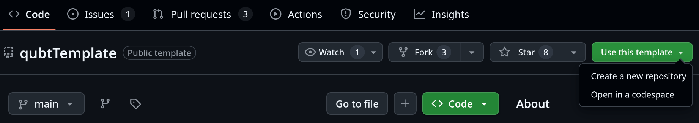
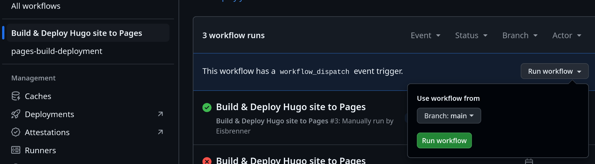
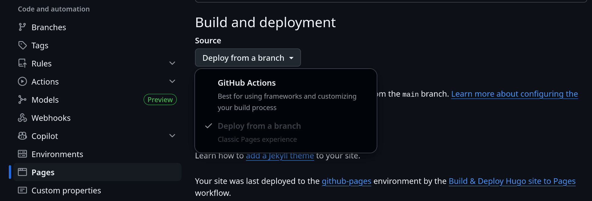

<!-- A stylized comic-style illustration with cyberpunk or steampunk vibes, showing the abstract process of creating a website. A lone character (gender-neutral or silhouetted) is building a glowing digital structure from floating code fragments, gears, and neon-lit nodes. The background is a moody workshop or futuristic digital space filled with wires, schematics, and ethereal interfaces. No actual screens or generic websites—just a symbolic, creative representation of web development and custom domain building. Use rich, vibrant colors with glowing accents and dynamic lighting. Artistic, slightly chaotic, and imaginative. -->

## TL;DR

+ Press *Use this template* on [qubtTemplate](https://github.com/chrede88/qubtTemplate) and create a new repository named `your_username.github.io`
+ Set up GitHub Actions workflows for the new repository
+ Set your full domain address as the base URL `baseURL=https://your_username.github.io` in `config/_default/hugo.yaml`
+ Make the changes you want, push them, and publish

---

A long time ago, I decided to create a website for myself. But, as it sometimes goes, life got in the way. Now, years later actually, a lucky coincidence finally nudged me to build one! So below are all the steps I followed to create the site you're viewing right now.

Table of contents:

- [TL;DR](#tldr)
- [A Hugo website template](#a-hugo-website-template)
- [GitHub Pages for hosting](#github-pages-for-hosting)
- [Customization and personalization](#customization-and-personalization)
- [Optional: A custom domain name](#optional-a-custom-domain-name)

## A Hugo website template

I first heard about [Hugo](https://gohugo.io/) at a previous workplace where colleagues were generally more tech-savvy than me. Still, I remembered how nice its templated sites looked, especially compared to other static site generators.

I had played with Hugo templates since, but as I'm neither a web developer nor a Go programmer, there was always something I couldn't bend to my needs. Not this time, though. I stumbled across a [template](https://chrede88.github.io/qubt/) that had most of what I wanted out of the box.

So let's dive into how to get it running.

First, install [Hugo](https://gohugo.io/) (note: the template has version requirements for both [Hugo](https://gohugo.io/) and [Go](https://go.dev)). I guess you don't NEED to have Hugo, but unless you have it, you cannot look at your website locally as it would render when deployed.

Second, get the template using GitHub's *repository template* functionality.

+ Head over to [qubtTemplate](https://github.com/chrede88/qubtTemplate), which is the template for the GitHub feature called *repository template*.
+ Click the ***Use this template*** button, and select from the drop down ***Create a new repository*** (you need to be logged in to GitHub!).
+ The name of the new repository must be `your_username.github.io`. Well, you probably guessed it, instead of `your_username`, of course, put in your username.



You should be sent over to your new repo after a bit. Once you arrive in your new repository, you can follow the README instructions. However, there are three points that I like to comment on.

(1) The `go.mod` file was prepared for me by the *repository template* (possibly an update to the *repository template* that didn't extend to the readme).

(2) In `config/_default/hugo.yaml` set the base URL to your GitHub Page

```yaml
baseURL=https://your_username.github.io
```

this is a requirement for the GitHub action used for publishing to work as intended.

(3) *Maybe not required anymore:* At one point I had an issue while running a local server, because of the non-default base URL. I had to run

```bash
hugo server --baseURL=http://localhost/
```

instead of simply `hugo server`. But that seems not to be the case anymore. So check what works for you.

Now, you are all set to modify your website after your heart's content, how to publish I'll go over in the next section.

## GitHub Pages for hosting

I'll now assume you named your repository as previously told, `your_username.github.io`, like mine is `eisbrenner.github.io`. This naming convention has been, and probably still is, a requirement of GitHub Pages. Note, what I write here next is also covered by the readme under ***Deploy on GitHub Pages***.

At this point, if you push your changes to GitHub, and both repo name and base URL are setup properly, your README will be hosted under your GitHub Pages URL. Anyway, that is not what we're after!

So, now we simply rename the directory which currently holds our rules for the deployment action (action being a GitHub term for some code execution). For example, from the root directory of your newly created repository you can run in the terminal

```bash
mv .github/deploymentWorkflow .github/workflows
```

to rename the directory which holds the deployment rules `buildDeploy.yaml`.

We, nearly done, next on our list, go to your website repository on github, click the ***Actions*** header and select the ***Build & Deploy Hugo site to Pages*** workflow (on the left side below *All workflows*). This opens the history of this *GitHub Action* and here you can run it manually, look on the right, there is a button ***Run workflow***, press and in the drop down press the green button with the same name.



After a moment, you have your own website under `https://your_username.github.io` (tho still containing the dummy materials from the template).

Finally, one last thing to fix, then we're done! Back to GitHub, since this relates to the automation settings there. We need to change the ***Build and deploy*** settings under your website repo's ***Pages*** settings.



Instead of **Deploy from a branch** we want to use **GitHub Actions**, so select that in the drop down menu from the button below *Source* under *Build and deployment*. Now the GitHub Action, as defined in our `.github/workflows/buildDeploy.yaml` tells us how publishing is handled. By default it should build and deploy each time we commit a new release or whenever we manually run our GitHub Action under the ***Actions*** header. The automatic part does not work for me yet, something is off with the rules for github pages under settings -- environments. Well, manually triggering the build and deploy action is fine for now.

## Customization and personalization

I chose to publish my website soon after, since there was not much I liked to change. But, a few things I did.

1. Place my name and profession in `config/_default/params.yaml` and `config/_default/hugo.yaml`.
2. Change the small default icons and my personal image to my photo of a Tokyo espresso cup :coffee:.
3. Rename the blog section to projects `config/_default/menus.yaml`.
4. Write my own, very brief, about page in `content/about.md`.
5. Add links to socials and websites via `config/_default/params.yaml`.


Commit, push, run the deployment action, and done! :partying_face:

## Optional: A custom domain name

Having a website under `https://your_username.github.io` is great and all, but using a custom domain like [https://ezra-eisbrenner.eu/](https://ezra-eisbrenner.eu/) isn't much more effort. It just costs a small yearly fee, tho costs depending on the domain name you want.

That said, while this isn't particularly difficult, I'm far from a web expert -- so take this section as a helpful nudge in the right direction and not more, instead go and check the official guides. Anyway, here I will repeat what the official [namecheap.com](https://www.namecheap.com/) article *how-do-i-link-my-domain-to-github-pages* said in early 2025, while you go and check your own registrar's most recent guide and follow the steps there.

Steps: Log in to your registrar's website, find your domain in the dashboard or in your list of domains, then select to manage the domain, and navigate to the header labelled **Advanced DNS**.

Now add four host records of type **A Record**'s with specific IP addresses, and one **CNAME Record** pointing to your github page name

| Type | Host | Value |
| --- | --- | --- |
| A Record | @ | 185.199.108.153 |
| A Record | @ | 185.199.109.153 |
| A Record | @ | 185.199.110.153 |
| A Record | @ | 185.199.111.153 |
| CNAME Record | www | your_username.github.io |

That's it! Wait a bit, because of hidden cogs setting in place somewhere in the depths of the internet, and then your new website should be found under your very own domain!
